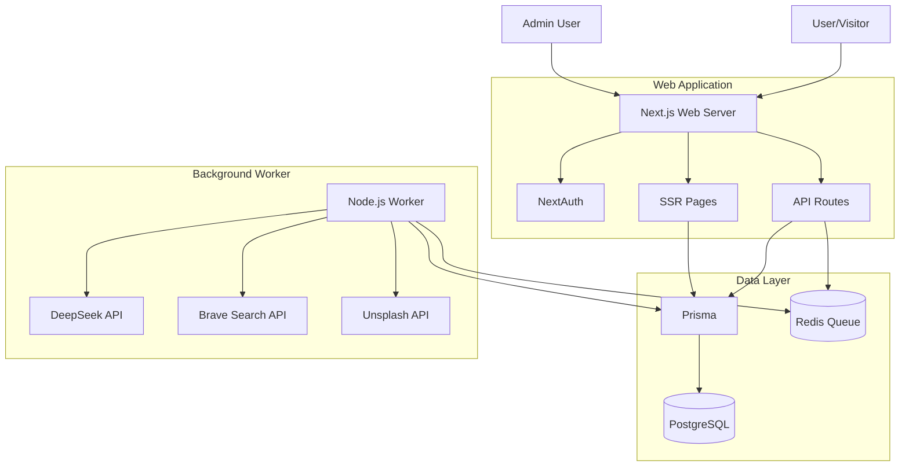

# Comprehensive Codebase Analysis: AI News Site

## 1. Project Overview
**Project Name:** ai-news-site  
**Type:** Modern Web Application & Autonomous Agent Platform  
**Tech Stack:** Next.js 15 (App Router), TypeScript, Prisma, PostgreSQL, Redis, BullMQ, TailwindCSS  
**Core Functionality:** An automated news platform that scrapes, rewrites, and publishes AI-related news using LLMs (DeepSeek Reasoner). It features a full-featured management dashboard, background job processing, and SEO optimization.

## 2. Detailed Directory Structure Analysis
Based on file imports and configuration, the project follows a standard Next.js App Router structure with a feature-rich `src` directory.

### `src/` - Core Application Code
- **`app/`**: Next.js App Router pages and API routes.
  - `layout.tsx`: Root layout with providers (Theme, Auth, Audio, Analytics).
  - `page.tsx`: Home page with dynamic fetching and caching strategies.
  - `api/`: Backend endpoints (Auth, Agent execution).
- **`components/`**: Reusable UI components (Shadcn UI likely used).
  - Contains `ClientProviders`, `SiteHeader`, `HeroCarousel`, `ArticleCard`.
- **`lib/`**: Utility functions and shared configuration.
  - `db.ts`: Prisma client instance.
  - `redis.ts`: Redis connection handler.
  - `queue.ts`: BullMQ queue configuration.
  - `auth.ts`: NextAuth configuration.
  - `utils.ts`: Helper functions (cn, etc.).
- **`workers/`**: Background job processors.
  - `news-agent.worker.ts`: Main logic for the autonomous news agent.
- **`services/`**: Business logic layer (inferred).
  - `agent.service.ts`: Core logic for scraping and rewriting news.

### `prisma/` - Database
- **`schema.prisma`**: Defines the data model (User, Article, AgentLog, etc.).

## 3. File-by-File Breakdown

### Core Application Files
- **`src/app/layout.tsx`**: Sets up the global shell. It integrates Google Analytics, ThemeProvider, and custom contexts like `AudioContext`. It forces `tr-TR` locale.
- **`src/app/page.tsx`**: The main landing page. It acts as a Server Component, fetching data directly from the DB (`db.setting`, `db.article`). It implements a fallback mechanism if DB is unreachable during build (`process.env.SKIP_ENV_VALIDATION`).

### Data Layer (Prisma)
- **`User` / `Account` / `Session`**: NextAuth.js standard models for authentication.
- **`Article`**: The core content model. Supports i18n (`ArticleTranslation`), SEO fields, and status workflow (`DRAFT`, `PUBLISHED`).
- **`AgentLog`**: Tracks the performance and status of the autonomous agent runs.
- **`Setting`**: Key-value store for runtime configuration (e.g., agent intervals).

### Background Workers
- **`src/workers/news-agent.worker.ts`**: A robust background worker using BullMQ.
  - Connects to Redis and Postgres.
  - Implements a safety timeout (15 mins) for agent execution.
  - Handles scheduling of the *next* run logic.
  - Syncs pending articles with IndexNow on startup.

### Configuration
- **`package.json`**: Defines scripts for dev (`next dev`), worker (`tsx src/workers...`), and production build.
- **`next.config.js`**: Configures `standalone` output for Docker, remote image patterns (Unsplash, Pexels), and ignores ESLint/TS errors during build (Production-ready compromise).

## 4. API Endpoints Analysis
- **`GET /`**: Home page (Server Component).
- **`POST /api/auth/[...nextauth]`**: Handles login/logout via NextAuth.
- **`POST /api/agent/execute`**: Protected endpoint to manually trigger the news agent.
- **`GET /api/agent/stats`**: (Inferred) Agent statistics.
- **`GET /rss.xml`**: (Inferred) RSS Feed generation.

## 5. Architecture Deep Dive
The application uses a **Hybrid Architecture**:
1.  **Frontend**: Server-Side Rendering (SSR) via Next.js for SEO and performance. Dynamic parts use Client Components.
2.  **Backend**: Next.js API Routes serve as the backend for the dashboard.
3.  **Worker Service**: A separate Node.js process (via `npm run worker`) handles long-running tasks. This decouples heavy AI processing from the web server.
    - **Flow**: Trigger -> BullMQ (Redis) -> Worker Process -> DeepSeek API -> Database -> IndexNow.

## 6. Environment & Setup Analysis
- **Variables**: The app relies heavily on `.env`.
  - **Database**: `DATABASE_URL`, `REDIS_URL`.
  - **Auth**: `NEXTAUTH_SECRET`.
  - **AI APIs**: `DEEPSEEK_API_KEY`, `BRAVE_API_KEY`, `UNSPLASH_ACCESS_KEY`.
  - **Security Note**: The `.env.example` file contains **potentionally real API keys**. These should be rotated immediately if this is a public repository.

## 7. Technology Stack Breakdown
- **Runtime**: Node.js 18+
- **Framework**: Next.js 14/15
- **Database**: PostgreSQL (Primary), Redis (Queue/Cache)
- **ORM**: Prisma
- **AI/LLM**: DeepSeek Reasoner (for content generation)
- **Search**: Brave Search API (for news discovery)
- **Styling**: TailwindCSS, Shadcn UI

## 8. Visual Architecture Diagram

## 9. Key Insights & Recommendations
1.  **Security Critical**: The `.env.example` file exposes what appear to be valid production keys. **Action**: Revoke keys and remove them from the file.
2.  **Robustness**: The worker implementation is solid, with connection checks, timeouts, and graceful shutdown handling.
3.  **Performance**: `next.config.js` enables `standalone` mode, which is excellent for Docker containerization.
4.  **SEO**: The schema includes extensive support for SEO (Meta tags, JSON-LD, IndexNow integration).
5.  **Code Quality**: The codebase uses strict typing (mostly), modular architecture, and modern Next.js patterns. The use of a separate worker process is a mature architectural choice.
